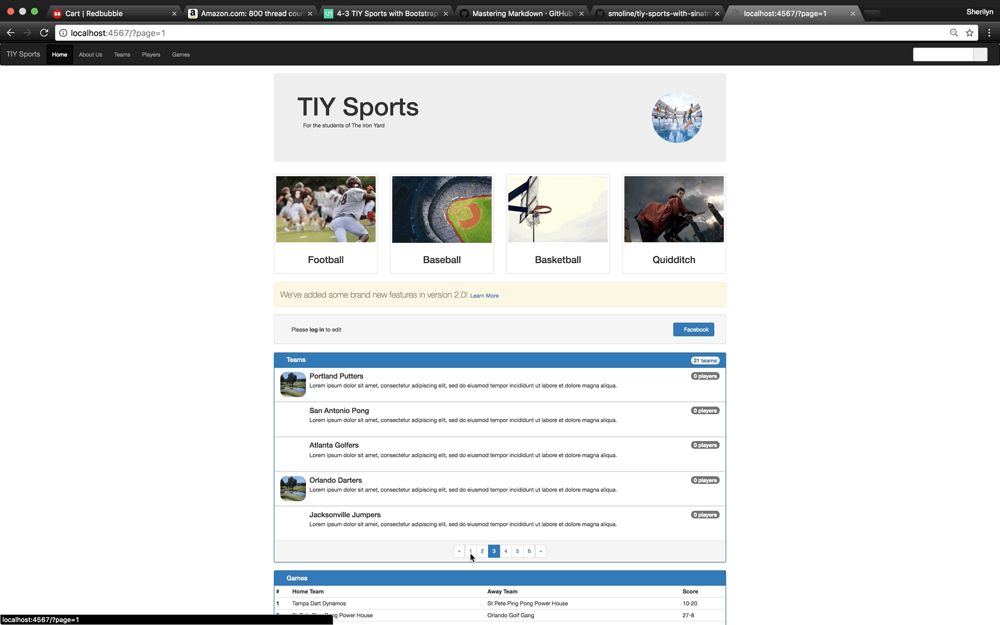

# Sinatra, Bootstrap, and Database Powered TIY Sports

## Assignment is to create a fully functional web app from a static designed page and pre-setup postgres Db

* To start this program you must have pstgresql and the sinatra gem installed    
  * run from the command line: ruby app.rb
  * open your browser to http://localhost:4567/

  

Congratulations! Your design of the TIY Sports homepage was a huge success and you have been approved to implement the application as a dynamic web application powered by Ruby, Sinatra, and the Postgres database!

## Setup

- Fork [this repo](https://github.com/tiy-tpa-ruby/tiy-sports-with-sinatra-bootstrap-pg)
- Setup your environment:
  ```sh
  take ~/tiy/week-4/day-3
  hub clone tiy-sports-with-sinatra-bootstrap-pg
  cd tiy-sports-with-sinatra-bootstrap-pg
  ```

- Setup the database:
  ```sh
  createdb tiy-sports
  uudecode -o /dev/stdout < tiy-sports.dmp | psql tiy-sports
  ```

### Tables that exist

```sql
create table players(id serial, name text);
create table teams(id serial, name text, description text, image_url text);
create table memberships(id serial, team_id integer, player_id integer);
```

## Explorer Mode

- Turn the `Teams` table into dynamic data from the database by querying:
  - The number of teams
  - Each teams image URL, name, description, and count of players
- You can leave the pagination and the games section as static HTML.

## Adventure Mode

- Create tables to store the information about the games. There is no existing tables or data for this in the database.
- Then you can turn the games table into dynamically generated data (including the scores)

## Epic Mode

- Turn the pagination of teams into dynamically generated page identifiers and make the pagination work.
- Use 5 as the number of teams per `page` and insert many more teams into the system.
